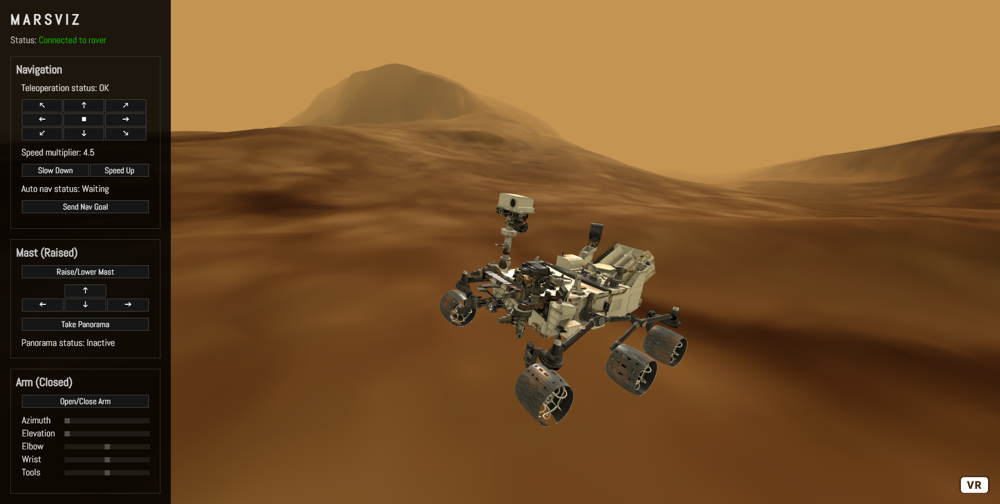

# curiosity_mars_rover_ws software package
ROS simulation of the Mars rover Curiosity with a web-based user interface

Uses ROS Noetic & Python 3, tested on Ubuntu 20.04 and Windows 11 via WSL2

This folder, `curiosity_mars_rover_ws`, is a Catkin workspace. The `src/` folder contains the five ROS packages developed as part of my University dissertation. They are based on the original `curiosity_mars_rover_description` package available from [The Construct](https://bitbucket.org/theconstructcore/curiosity_mars_rover/src/master/):

 - `curiosity_mars_rover_gazebo`:              Launches a Curiosity Mars rover simulation using the Gazebo simulator as an environment      
 - `curiosity_mars_rover_description`:         Describes the simulated rover using Collada 3D models and URDF descriptions
 - `curiosity_mars_rover_control`:             Enables teleoperation of the rover via command-line interfaces and ROS messages
 - `curiosity_mars_rover_navigation`:          Enables autonomous navigation using the move_base ROS package
 - `curiosity_mars_rover_viz`:                 Launches a web application for visualisation and control of the rover in VR

## To install everything automatically (including ROS and Gazebo):
 1. Make sure this folder (not just its contents) is in your /home/username/ folder (where 'username' is your Linux user name). 
 2. In a terminal, navigate to this folder and type:
 
`bash install_everything.sh`

 3. You will be prompted for your password. After typing it in, the installation will take roughly 10 minutes and use 4.8GB of disk space. 
 4. Afterwards, you'll need to start a new terminal in order to access the simulation. Reload your current terminal window by typing:
 
 `exec bash`
 
 Once these steps are completed, you will be able to run 'roslaunch' commands, for example:

`roslaunch curiosity_mars_rover_gazebo main_mars_terrain.launch`

More commands and available launch parameters are provided in the user manual PDF.

## Additional notes
**Installing to an existing Catkin workspace**

The `install_everything.sh` script can also take an alternative Catkin workspace folder name as a parameter.
For instance, if you want to install this project into an existing workspace called `catkin_ws` (the typical Catkin workspace name), you can copy the contents of this folder into your workspace and run:

`bash install_everything.sh catkin_ws`

This will install everything using the workspace 'catkin_ws'.

**Web application security**

The web application requires a security certificate in order to run. An example has been provided and will be installed as part of the installation script, however this certificate will expire at some point in the future. If you have discovered this repository amid the ruins of civilisation, new certificates can be created using the following command:

`openssl req -x509 -newkey rsa:4096 -keyout server1.example.com.key -out server1.example.com.pem -days 365 -nodes`

The two new files should then be moved to the system configuration folder:

`sudo mkdir /etc/ssl/certs/localcerts/ -p`

`sudo mv server1.example.com.key /etc/ssl/certs/localcerts/server1.example.com.key`

`sudo mv server1.example.com.pem /etc/ssl/certs/localcerts/server1.example.com.pem`

Finally, the permissions of the files should be set:

`sudo chmod 777 /etc/ssl/certs/localcerts/server1.example.com.key`

`sudo chmod 777 /etc/ssl/certs/localcerts/server1.example.com.pem`

You will then be able to visualise the rover by running the following ROS launch command:

`roslaunch curiosity_mars_rover_viz marsviz_mars_terrain.launch`

The web application can then be accessed by going to https://127.0.0.1:8080/.
